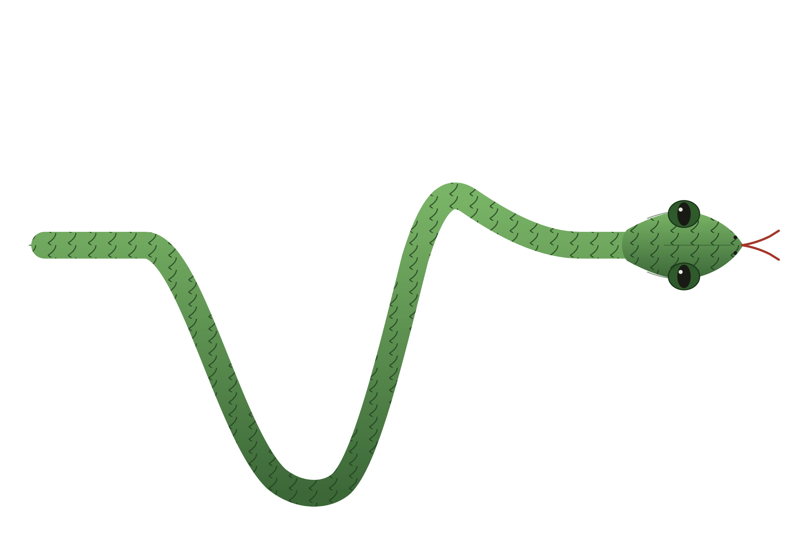

# snakeSort



A Snakemake pipeline for Neuropixels preprocessing: pull a bird's recordings off the rig, run CatGT, concatenate runs with supercat, estimate motion with dredge, and spike-sort with Kilosort4.

## Pipeline

```
transferFiles (rclone)
  -> makeMetaDf (checkpoint)
  -> runCatGT        [per run]
  -> runSupercat
      -> backupAndDeleteData (raw data -> S3 Deep Archive)
      -> doDredge      [per stream] -> runKilosort [per stream] -> runBombcell [per stream]
```

Bad channels are detected once per bird/stream (cached as `imec{stream}_bad_channels.json`) and reused by every downstream step instead of being recomputed.

## Requirements

Besides the Python dependencies below, the pipeline shells out to a few external tools that aren't pip-installable:

- **CatGT** — vendored in `CatGT-linux/`, path set via `catGTparams.CATGTPATH` in `config.yaml`.
- **rclone** — must have a remote configured (matching `rigDir` in `config.yaml`) that can reach the recording rig.
- **AWS CLI** — must be configured with credentials that can write to the S3 bucket in `~/.aws/addr`.

## Install

```bash
pip install -e .
```

This installs Snakemake and the Python dependencies (spikeinterface, kilosort, pandas, etc.) and makes the pipeline's helper scripts (`make_CatGT_args`, `make_DredgeFiles`, `runKilosort`, ...) importable.

## Configure

Edit `config.yaml`:

| field | meaning |
|---|---|
| `birdName` | bird to process this run |
| `workingDir` | where `rawData/`, `pass_1/`, `pass_2/` get written |
| `rigDir` | rclone remote:path for the rig's recording share |
| `catGTparams.CATGTPATH` | path to CatGT's `runit.sh` |
| `catGTparams.filtmode` / `apfilter` / `zerofillmax` | passed straight through to CatGT |
| `catGTparams.sepShanks` | split each probe into 4 per-shank streams instead of one stream per probe |

## Run

```bash
snakemake -c<N>          # run with N cores
snakemake -n              # dry run - see what would execute
```

Logs for each rule land in `{workingDir}/logs/`.
